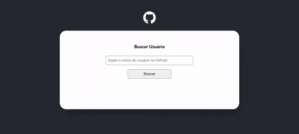

# Quest de JavaScript Avançado

Atividade feita durante o curso DevQuest, dos irmãos Ricardo e Roberto (<a href="https://www.instagram.com/devemdobro" target="_blank">@devemdobro</a>).

## Prévia

## Tecnologias utilizadas

- HTML
- CSS
- JavaScript

## Coisas que aprendi

- Import e Export (módulos JavaScript);
- Fetch API;
- Async e Await;
- Promises.

